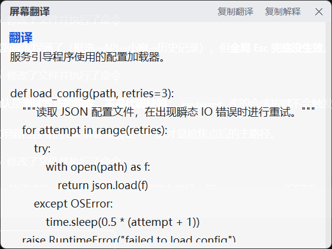
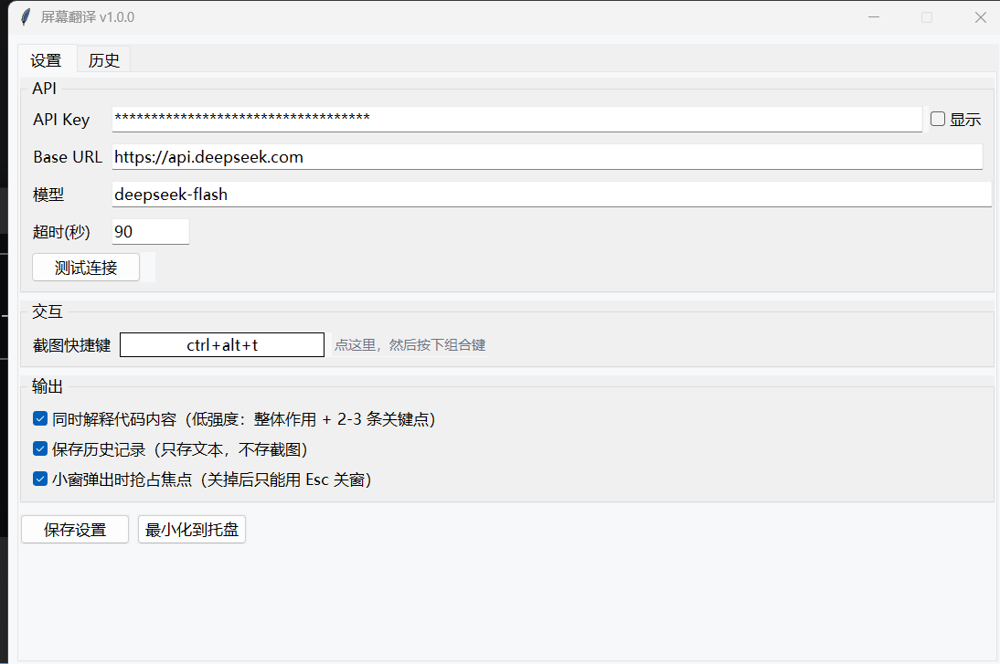

# 屏幕翻译 · ScreenTranslator

Windows 桌面小工具。按下全局快捷键框选屏幕上任意区域，松手后自动识别其中的英文并翻译成中文；
如果框到的是代码，再附上一段克制的代码解释。结果用一个无边框悬浮小窗显示，按 `Esc` 关掉。

截图直接交给 DeepSeek 的视觉模型，识别、翻译、解释一次调用完成，本地不需要装 OCR 引擎。



## 它做什么

- **框选即翻译**：在设置里设好快捷键（默认 `Ctrl+Alt+T`），在任何程序里按下就能框选。
- **代码也看得懂**：框到代码时给 2-3 条要点，说清整体在做什么，只在有坑的地方提醒一句。
- **不破坏原文**：函数名、变量名、命令、路径、报错原文原样保留，只翻译自然语言。
- **历史记录**：只存文本和时间戳，不保存截图。



## 环境要求

- Windows 10 / 11
- Python 3.11 或更高（开发时验证于 3.14.7）
- 一个 DeepSeek API Key，在 [platform.deepseek.com](https://platform.deepseek.com/) 申请

## 安装

```powershell
git clone <this-repo>
cd <repo>
pip install -r requirements.txt
python main.py
```

首次启动后，在「设置」页填入 API Key，点「测试连接」确认能通，再点「保存设置」。

## 使用

| 操作 | 结果 |
| --- | --- |
| `Ctrl+Alt+T`（可改） | 屏幕变暗，拖拽框选 |
| 松开鼠标 | 弹出小窗，显示翻译与解释 |
| `Esc` | 关闭小窗 |
| 框选过程中右键或按 `Esc` | 取消本次框选 |
| 最小化按钮 | 收进系统托盘，程序继续运行 |
| 点 × | 直接退出程序 |

托盘图标右键可「开始框选」「打开设置」「退出」。

## 配置文件

配置和数据都在 `%APPDATA%\ScreenTranslator\`：

- `config.json` —— 设置，**内含明文 API Key**
- `history.json` —— 历史记录，只有文本

字段模板见 `config.example.json`。开发时可以用环境变量 `SCREEN_TRANSLATOR_HOME`
把数据目录指到别处，避免污染正式配置。

## 费用

按 DeepSeek 官方计费，单张截图最多按 1024 tokens 计。一次框选翻译实际约 800-1000 tokens，
off-peak 时段约 0.003 元，1 元钱能跑 300 次左右；峰值时段翻倍。

## 打包成单文件 exe

```powershell
pip install pyinstaller
python build.py
```

产物是 `dist/ScreenTranslator.exe`，双击即可运行，目标机器不需要装 Python。

## 已知限制

- **管理员权限的窗口**：目标窗口若以管理员身份运行，普通权限下的本程序可能收不到热键或截到黑屏，
  需要同样以管理员身份运行本程序。
- **硬件加速画面**：视频播放器、部分游戏和开启硬件加速的 Electron 应用可能截到黑屏，
  这是 Windows 截屏 API 的固有限制，不是本程序的 bug。
- **多显示器混合缩放**：程序以 per-monitor DPI 感知运行，单屏和缩放比一致的多屏已验证，
  不同屏缩放比不一致的情况（如一块 100% 一块 150%）未充分测试。
- **全局 `Esc` 兜底依赖 keyboard 库的键盘钩子**。小窗弹出时默认抢焦点，此时 `Esc` 走窗口自身绑定，
  最可靠；关掉「抢占焦点」后才依赖全局钩子。
- **抢焦点会打断输入**。正在别处打字时弹出小窗会抢走焦点，在设置里取消勾选即可关闭这个行为。

## 隐私

框选的屏幕截图会以 base64 发送到 `api.deepseek.com`。**不要用它框选包含密码、密钥、
个人隐私的画面。** 程序只在本地保存 API Key 和翻译结果，不做其他上传。

## 卸载

1. 退出程序
2. `pip uninstall pillow pystray keyboard`
3. 删除 `%APPDATA%\ScreenTranslator\` 目录（这一步会一并删掉保存的 API Key）

## 排查问题

先跑自检：

```powershell
python selftest.py --api
```

它会依次检查依赖、DPI 感知、截图尺寸是否与虚拟桌面一致、热键能否注册、API 是否通。

## License

MIT，见 [LICENSE](LICENSE)。
