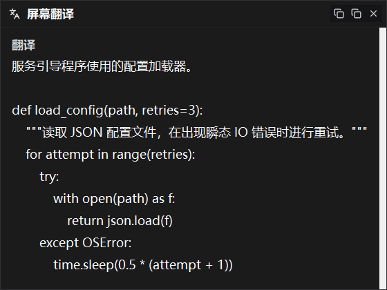
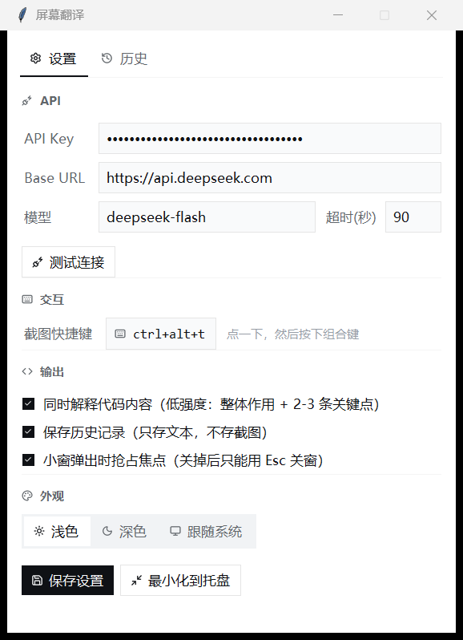
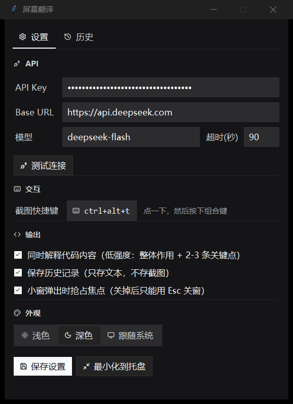

# 屏幕翻译 · ScreenTranslator

Windows 桌面小工具。按下全局快捷键框选屏幕上任意区域，松手后自动识别其中的英文并翻译成中文；
如果框到的是代码，再附上一段克制的代码解释。结果用一个无边框悬浮小窗显示，按 `Esc` 关掉。

截图直接交给 DeepSeek 的视觉模型，识别、翻译、解释一次调用完成，本地不需要装 OCR 引擎。



## 它做什么

- **框选即翻译**：在设置里设好快捷键（默认 `Ctrl+Alt+T`），在任何程序里按下就能框选。
- **代码也看得懂**：框到代码时给 2-3 条要点，说清整体在做什么，只在有坑的地方提醒一句。
- **不破坏原文**：函数名、变量名、命令、路径、报错原文原样保留，只翻译自然语言。
- **历史记录**：只存文本和时间戳，不保存截图。





## 环境要求

- Windows 10 / 11
- Python 3.11 或更高（开发时验证于 3.14.7）
- 一个 DeepSeek API Key，在 [platform.deepseek.com](https://platform.deepseek.com/) 申请

## 安装

```powershell
git clone https://github.com/cyberbutterfly0/screen-translator.git
cd screen-translator
pip install -r requirements.txt
python install.py     # 在桌面创建带图标的快捷方式
```

`install.py` 会在桌面生成一个指向 `pythonw.exe` 的快捷方式，图标用程序自带的 `icon.ico`。
之后双击桌面图标就能启动，**不会触发任何安全警告**——因为启动的是 Python 官方签名的解释器，
而不是一个未签名的打包产物。

> 如果项目路径含中文（例如 `E:\我的项目\`），`install.py` 会先把 `icon.ico` 复制到
> `%APPDATA%\ScreenTranslator\` 再引用它。这不是多此一举：实测**快捷方式的图标路径只要含
> 非 ASCII 字符，资源管理器就会放弃加载、显示成默认文档图标**，而且在属性里手动改图标也无效。

不想建快捷方式也可以直接跑：

```powershell
python main.py
```

首次启动后，在「设置」页填入 API Key，点「测试连接」确认能通，再点「保存设置」。

## 关于 SmartScreen 警告（只在用 exe 时才会遇到）

Release 里提供的 exe 没有数字签名，双击时 Windows 可能弹「Windows 已保护你的电脑」。
这是 SmartScreen 对**未签名程序**的拦截，不是报毒——满足下面任一情况就会弹：

- 文件从互联网下载，带着「来自 Internet」标记
- 或者程序根本没有代码签名证书（Windows 11 对这类程序本身就会拦，**即使清掉标记也没用**）

**推荐直接用源码方式启动**（上面的 `install.py`），完全不经过这个检查，也绕开了下面说的路径问题。

### 一定要用 exe 的话

先放行：

- 弹窗里先点「更多信息」，再点随后出现的「仍要运行」
- 或者右键 exe → 属性 → 底部勾选「解除锁定」
- 或者 PowerShell 执行 `Unblock-File`，**路径要写对**（`.\` 指当前目录，不是文件所在目录）：

  ```powershell
  Unblock-File "$env:USERPROFILE\Downloads\ScreenTranslator.exe"
  ```

然后**务必把它放到纯英文路径下**（例如 `C:\ScreenTranslator\`）。放在含中文的目录里会直接启动失败，
报 `Could not create temporary directory!`，原因见「已知限制」。

不要为了省事整体关掉 SmartScreen，那会降低系统整体的防护。

### 校验下载的文件

比对 SHA256：

```powershell
Get-FileHash .\ScreenTranslator.exe -Algorithm SHA256
```

每个版本 Release 资产的官方摘要可以直接查：

```powershell
gh release view v1.0.1 --json assets --jq '.assets[] | {name, digest}'
```

**为什么可以信任它**：exe 由 GitHub Actions 在公开的托管 runner 上、从本仓库的公开源码构建，
构建配置就是 `.github/workflows/release.yml`，任何人都能查看运行记录，也可以自己 `python build.py` 复现。

### 想彻底消除警告

只有买代码签名证书一条路：OV 证书约每年千元级，但**签完初期照样会被拦**（微软要等下载量积累出信誉）；
EV 证书更贵，好处是立刻获得信誉。除此之外的办法都只是让用户多点一次按钮。

## 使用

| 操作 | 结果 |
| --- | --- |
| `Ctrl+Alt+T`（可改） | 屏幕变暗，拖拽框选 |
| 松开鼠标 | 弹出小窗，显示翻译与解释 |
| `Esc` | 关闭小窗 |
| 框选过程中右键或按 `Esc` | 取消本次框选 |
| 最小化按钮 | 收进系统托盘，程序继续运行 |
| 点 × | 直接退出程序 |

托盘图标右键可「开始框选」「打开设置」「退出」。

## 外观

界面风格对齐 DeepSeek Harness：无彩色强调色、细边框、中性灰阶。主按钮在浅色主题下是黑底白字，
深色主题下反过来。

「设置 → 外观」可选**浅色 / 深色 / 跟随系统**，默认跟随 Windows 的应用主题，切换即时生效。

窗口标题栏会跟着主题走（用 DWM 的沉浸式深色模式），不会出现浅色标题栏配深色内容区的割裂感。
框选覆盖层是无彩遮罩加白色边框，尺寸提示实时跟随光标。

图标统一用 [lucide](https://lucide.dev)，24px 网格、2px 圆头描边。

## 配置文件

配置和数据都在 `%APPDATA%\ScreenTranslator\`：

- `config.json` —— 设置。API Key 用 Windows DPAPI 加密后保存（`dpapi:` 前缀）
- `config.backup.json` —— 上一次保存前的配置备份
- `history.json` —— 历史记录，只有文本
- `app.log` —— 运行日志，出问题时把它发给开发者

字段模板见 `config.example.json`。开发时可以用环境变量 `SCREEN_TRANSLATOR_HOME`
把数据目录指到别处，避免污染正式配置。

**API Key 有三层防误删**：设置里默认是**锁定**的（掩码显示），点旁边的「修改」才能编辑；
万一清空了，保存时会先弹确认；而且每次覆盖配置前都会自动留一份 `config.backup.json`，
真丢了可以从这里找回。

## 费用

按 DeepSeek 官方计费，单张截图最多按 1024 tokens 计。一次框选翻译实际约 800-1000 tokens，
off-peak 时段约 0.003 元，1 元钱能跑 300 次左右；峰值时段翻倍。

## 换成其他厂商的模型

调用层走的是 OpenAI 兼容协议，只要目标服务支持图片输入，理论上都能接：

1. 在设置里把 Base URL 和模型名换成对方的，例如
   - OpenAI：`https://api.openai.com/v1` + `gpt-4o-mini`
   - 通义千问：`https://dashscope.aliyuncs.com/compatible-mode/v1` + `qwen-vl-max`
   - 智谱：`https://open.bigmodel.cn/api/paas/v4` + `glm-4v-flash`
2. 保存后点「测试连接」

DeepSeek 有两个专有参数（关思考模式的 `thinking`、`detail: "original"`），别家不认。
程序被拒时会自动去掉它们重试一次，并在小窗底部标注「已自动降级重试」，正常情况不需要改代码。

需要注意：

- Base URL 要带上对方要求的版本路径（OpenAI 兼容接口一般是 `/v1`），
  程序会自动在后面补 `/chat/completions`
- 有些新模型用 `max_completion_tokens` 取代了 `max_tokens`，如果报这个错，需要改
  [api_client.py](api_client.py) 里的 `max_tokens`
- 换厂商后翻译质量、代码理解能力、速度都会变，自己试一下再定

## 更换图标

图标源文件在 `assets/icons/src/*.svg`，是从 lucide 拉下来的原始 SVG。换图标两步：

1. 把新的 SVG 放进 `assets/icons/src/`
2. 运行 `python build_icons.py`

脚本自己解析 SVG（只用到 `path` / `circle` / `rect` / `line` 四种元素和少数几种路径命令），
渲染成 96×96 的白色 PNG，并顺带生成多尺寸的 `icon.ico`。
图标在运行时按主题着色，所以一套 PNG 就同时适配浅色和深色，不用维护两套资源。

> **`icon.ico` 是脚本自己拼字节拼出来的，没有用 Pillow 的 ICO 保存器。**
> Pillow 12 会把**所有**尺寸都写成 PNG 压缩，而标准 ICO 只有 256×256 能用 PNG，
> 小尺寸必须是未压缩的 BMP/DIB。全 PNG 的 ICO 用 `ExtractIconEx` 能正常读出来，
> 但资源管理器渲染桌面图标时走的是更严格的路径，会直接放弃并显示成默认图标——
> 这个坑很隐蔽，因为常规的 API 验证发现不了。

## 打包成单文件 exe

```powershell
pip install -r requirements-dev.txt
python build.py
```

产物是 `dist/ScreenTranslator.exe`，目标机器不需要装 Python。两点务必注意：

- **产物必须放在纯英文路径下运行**。含中文的目录（比如 `E:\我的项目\dist\`）会让它
  启动失败，报 `Could not create temporary directory!`，原因见「已知限制」
- 这个 exe 没有数字签名，别人下载后会被 SmartScreen 拦一次，见上文

自己用的话，**源码方式（`install.py`）比打包 exe 更省事**：不用打包、不弹警告、改了代码立刻生效。

## 开发

```powershell
pip install -r requirements-dev.txt

# 单元测试
python -m unittest discover -s tests -t . -v

# 环境自检（加 --api 会真实调用一次模型）
python selftest.py --api
```

仓库带两条 GitHub Actions 流水线：

- `ci.yml` —— push / PR 时跑语法检查、单元测试、图标重新生成，并完整打包一次 exe
- `release.yml` —— 推送 `v*` tag 时自动打包并把 exe 附到 Release

所以发新版本可以简化成两步：

```powershell
git tag -a v1.0.1 -m "更新说明"
git push origin v1.0.1
```

`tests/test_config.py` 里有一条测试会扫描所有源码，确保 `DEFAULTS` 里的每个配置项
都真的被消费——防止再出现"定义了但没人用"的幽灵配置。

## 已知限制

- **打包的 exe 不能放在含中文的路径下**：PyInstaller 的 bootloader 处理自身路径时对非 ASCII
  字符有问题，会报 `Could not create temporary directory!` 然后启动失败。
  把 exe 挪到 `C:\ScreenTranslator\` 这类纯英文路径即可。**源码方式不受影响。**
- **管理员权限的窗口**：目标窗口若以管理员身份运行，普通权限下的本程序可能收不到热键或截到黑屏，
  需要同样以管理员身份运行本程序。
- **硬件加速画面**：视频播放器、部分游戏和开启硬件加速的 Electron 应用可能截到黑屏，
  这是 Windows 截屏 API 的固有限制，不是本程序的 bug。
- **多显示器混合缩放**：程序以 per-monitor DPI 感知运行，单屏和缩放比一致的多屏已验证，
  不同屏缩放比不一致的情况（如一块 100% 一块 150%）未充分测试。
- **全局 `Esc` 兜底依赖 keyboard 库的键盘钩子**。小窗弹出时默认抢焦点，此时 `Esc` 走窗口自身绑定，
  最可靠；关掉「抢占焦点」后才依赖全局钩子。
- **抢焦点会打断输入**。正在别处打字时弹出小窗会抢走焦点，在设置里取消勾选即可关闭这个行为。

## 隐私

框选的屏幕截图会以 base64 发送到 `api.deepseek.com`。**不要用它框选包含密码、密钥、
个人隐私的画面。** 程序只在本地保存 API Key 和翻译结果，不做其他上传。

API Key 用 Windows DPAPI 加密存放，但它防的是"配置文件被拷到别的机器"和"别的用户读到"，
**挡不住以你自己身份运行的恶意程序**——同账户的进程仍然可以调用 DPAPI 解密。
从旧版本升级上来的明文 Key 会在下次保存设置时自动加密。

## 卸载

1. 退出程序
2. `pip uninstall pillow pystray keyboard`
3. 删除 `%APPDATA%\ScreenTranslator\` 目录（这一步会一并删掉保存的 API Key）

## 排查问题

先跑自检：

```powershell
python selftest.py --api
```

它会依次检查依赖、配置、DPI 感知、截图尺寸是否与虚拟桌面一致、热键能否注册、
图标资源是否齐全；加上 `--api` 还会真实调用一次模型。每一项都独立捕获异常，
所以一次就能拿到完整报告，不会在第一个坑上停住。

程序自己的运行日志在 `%APPDATA%\ScreenTranslator\app.log`。未捕获的异常（含子线程）
都会记进去——打包后的 exe 没有控制台，这是唯一能看到出错原因的地方，反馈问题时请带上它。

## License

MIT，见 [LICENSE](LICENSE)。
